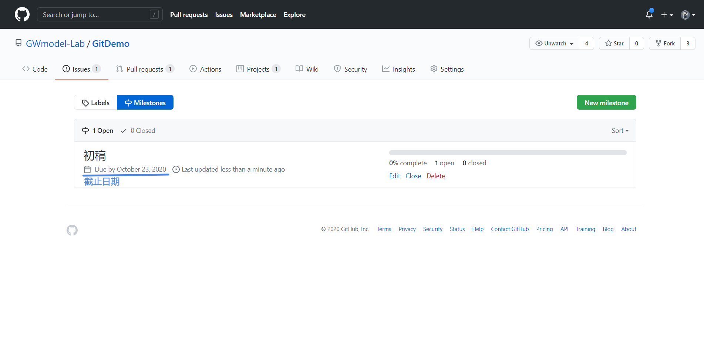

# Git 的使用

## 版本控制系统

### 什么是版本控制

版本控制是用于对某一组文件进行版本的记录，即在某一时刻为这一组文件提供一个快照，并将此快照进行存储。当你需要查看一个之前的快照（称之为“版本”）时，版本控制系统可以显示出当前版本与上一个版本之间的所有改动的细节。

### 为什么需要进行版本控制

1. 存储文件副本

   可能你平时在进行coding的时候，需要对当前的这个文件进行备份，避免你写的代码使得原来的文件混乱了，导致回不到原来的结果。尤其在修复bug的时候，是非常重要的。

2. 版本控制

   避免版本管理混乱。这是使用版本管理的最主要原因，也是版本管理的目的所在。你肯定不会希望在本地手动备份了多个副本后，到头来却不知道那个备份是最新的，那个备份进行了什么修改，修改日期是什么时候等等一切你记不清的问题。而版本管理软件能解决这些问题，它有详细的日志，能记住你的每一次提交、每一次改动，并且能够比较查看不同版本之间的异同，并且可以恢复到之前的任一版本。

3. 提高协同效率

   在进行多人开发的时候，使用版本控制系统可以非常好的避免在代码合并的时候可能出现的文件混乱等现象，例如你在手动合并代码的时候，可能会漏掉某些文件，也可能某个文件的某个段落漏掉了等等，这在两个人协同开发的时候就容易出现问题，三个，四个人，会有非常大的概率出现这些问题。

4. 明确分工责任

   使用版本控制系统可以非常容易定位出现bug的代码是谁写的，可以评估每个人的代码能力，代码风格等，明确责任。

### 版本控制软件的发展历史

最开始没有版本控制管理工具，代码的整合和备份都靠手工完成，手工备份历史文件，非常容易出错。

#### 手动管理时代

早期(1970年到1980年代)的软件开发大部分是愉快的个人创作。比如UNIX下的sed是L. E. McMahon写的，Python的第一个编译器是Guido写的，Linux最初的内核是Linus写的 (好吧，awk是个例外，它的名字是三位作者的首字母，但也只是三个人)。这些程序员可以用手工的方式进行备份，并以注释或者新建文本文件来记录变动。

正如现在普通用户常做的，当时的程序员常用cp备份:

```shell
$ cp dev.c dev.bak
```

更有条理一些的程序员会加上一个时间标记，比如:

```shell
$ cp dev.c dev.bak.19890908
```

程序员很可能会用vi创建一个LOG文件来做日志:

```
1989-09-08 02:00:00
Old input method is stupid
Add command-line input function
```

在一个版本发布的时候，程序员可能做一个tar归档，将所有的文件归为同一个.tar文件。

```shell
$ tar -cf project_v1.0.tar project
```

上面的工具构成了一套人工VCS。上面的这套组合也非常符合UNIX的模块化理念：让每个应用专注于一个小的功能，使用者根据需要，将这些功能连接起来。你还可以写一个shell脚本，将上面的功能都写在里面。当需要的时候，调用该脚本就可以了。


再说一下早期的合作开发模式。通常来说，当时的程序员通过电子邮件接收补丁(patch)，并将补丁应用到原来的代码文件。实际上，一个补丁(patch)的主要功能是描述两个文件的改变(change, or file delta)。 假设我们有两个文件`a.c`和`b.c`内容分别为:

```c
// a.c (有bug的代码)
int sum(int a, int b)
{
  int c;
  c = a + 1;
  return c;
} 
```

```c
// b.c  (修正后的代码)
int sum(int a, int b)
{
  int c;
  c = a + b;
  return c;
}
```

在UNIX系统下，运行

```shell
$ diff a b > iss01.patch
```

`iss01.patch`就是一个补丁文件，它看起来如下：

```
4c4
<   c = a + 1;
---
>   c = a + b;
```

这个补丁表示，更改原文件第四行的`c = a + 1;`，改为`c = a + b;`，更改后的这一行位于新的文件的第四行。

使用patch命令将`iss01.patch`应用到`a.c`上，相当于将 `b.c-a.c` 的改变作用在a上，`a.c`将和`b.c`有一样的内容：

```shell
$ patch a.c < iss01.patch
```

当我发现`a.c`的代码有错误时，可以将我修改后的`b.c`与原来的`a.c`做diff获得补丁文件，并将补丁发给程序员，并告诉他该补丁是为了修正`a.c`代码中的加法错误。程序员确认之后，就可以使用patch应用该补丁了。在后面我们将看到，这种diff-patch的工作方式被VCS不同程度的采用。


#### 早期的版本控制

早在70年代末80年代初，VCS的概念已经存在，比如UNIX平台的RCS (Revision Control System)。RCS是由Walter F. Tichy使用C开发。RCS对文件进行集中式管理，主要目的是避免多人合作情况下可能出现的冲突。如果多用户同时写入同一个文件，其写入结果可能相互混合和覆盖，从而造成结果的混乱。你可以将文件交给RCS管理。RCS允许多个用户同时读取文件，但只允许一个用户锁定(locking)并写入文件 (类似于多线程的mutex)。这样，当一个程序员登出(check-out，见RCS的co命令)某个文件并对文件进行修改的时候。只有在这个程序完成修改，并登入(check-in，见RCS的ci命令)文件时，其他程序员才能登出文件。基本上RCS用户所需要的，就是co和ci两个命令。在co和ci之间，用户可以对原文件进行许多改变(change, or file delta)。一旦重新登入文件，这些改变将保存到RCS系统中。通过check-in将改变永久化的过程叫做提交(commit)。

RCS的互斥写入机制避免了多人同时修改同一个文件的可能，但代价是程序员长时间的等待，给团队合作带来不便。如果某个程序员登出了某个文件，而忘记登入，那他就要面对队友的怒火了。(从这个角度上来说，RCS造成的问题甚至大于它所解决的问题……)

文件每次commit都会创造一个新的版本(revision)。RCS给每个文件创建了一个追踪文档来记录版本的历史。这个文档的名字通常是原文件名加后缀,v (比如main.c的追踪文档为main.c,v)。追踪文档中包括：最新版本的文件内容，每次check-in的发生时间和用户，每次check-in发生的改变。在最新文档内容的基础上，减去历史上发生的改变，就可以恢复到之前的历史版本。这样，RCS就实现了备份历史和记录改变的功能。

相对与后来的版本管理软件，RCS纯粹线性的开发方式非常不利于团队合作。但RCS为多用户写入冲突提供了一种有效的解决方案。RCS的版本管理功能逐渐被其他软件(比如CVS)取代，但时至今日，它依然是常用的系统管理工具。

#### CVS

1986年，Dick Grune写了一系列的shell脚本用于版本管理，并最终以这些脚本为基础，构成了CVS (Concurrent Versions System)。CVS后来用C语言重写。CVS是开源软件。在当时，Stallman刚刚举起GNU的大旗，掀起开源允许的序幕。CVS被包含在GNU的软件包中，并因此得到广泛的推广，最终击败诸多商业版本的VCS，呈一统天下之势。

CVS继承了RCS的集中管理的理念。在CVS管理下的文件构成一个库(repository)。与RCS的锁定文件模式不同，CVS采用复制-修改-合并(copy-modify-merge)的模式，来实现多线开发。CVS引进了分支(branch)的概念。多个用户可以从主干(也就是中心库)创建分支。分支是主干文件在本地复制的副本。用户对本地副本进行修改。用户可以在分支提交(commit)多次修改。用户在分支的工作结束之后，需要将分支合并到主干中，以便让其他人看到自己的改动。所谓的合并，就是CVS将分支上发生的变化应用到主干的原文件上。比如下面的过程中，我们从r1.1分支出rb1.1.2.*，并最终合并回主干，构成r1.2

CVS与RCS类似，使用,v文件记录改变，以便追踪历史。在合并的过程中，CVS将两个change应用于r1.1，就得到了r1.2:

```
r1.2 = r1.1 + change(rb1.1.2.2 - rb1.1.2.1) + change(rb1.1.2.1-r1.1)
```

上面的两个改变都记录在,v文件中，所以很容易提取。

在多用户情况下，可以创建多个分支进行开发，比如：


在这样的多分支合并的情况下，有可能出现冲突(colliding)。比如上图中，第一次合并和第二次合并都对r1.1文件的同一行进行了修改，那么r1.3将不知道如何去修改这一行。CVS要求冲突发生时的用户手动解决冲突。用户可以调用编辑器，对文件发生合并冲突的地方进行修改，以决定最终版本(r1.3)的内容。

 

CVS管理下的每个文件都有一系列独立的版本号(比如上面的r1.1,r1.2,r1.3)。但每个项目中往往包含有许多文件。CVS用标签(tag)来记录一个集合，这个集合中的元素是一对(文件名：版本号)。比如我们的项目中有三个文件(file1, file2, file3)，我们创建一个v1.0的标签：

tag v1.0 (file1:r1.3) (file2:r1.1) (file3:r1.5)

v1.0的tag中包括了r1.3版本的文件file1，r1.1版本的file2…… 一个项目在发布(release)的时候，往往要发布多个文件。标签可以用来记录该次发布的时候，是哪些版本的文件被发布。

 

CVS应用在许多重要的开源项目上。在90年代和00年代初，CVS在开源世界几乎不二选择 (RCS也是开源的，但正如我们已经提到的，RCS无法与CVS媲美)。时至今天，尽管CVS已经长达数年没有发布新版本，我们依然可以在许多项目中看到CVS的身影。


#### SVN
CVS也有许多常常被人诟病的地方，比如下面几条：

- 合并不是原子操作(atomic operation)：如果有两个用户同时合并，那么合并结果将是某种错乱的混合体。如果合并的过程中取消合并，不能撤销已经应用的改变。
- 文件的附加信息没有被追踪：一旦纳入CVS的管理，文件的附加信息(比如上次读取时间)就被固定了。CVS不追踪它所管理文件的附加信息的变化。
- 主要用于管理ASCII文件：不能方便的管理Binary文件和Unicode文件
- 分支与合并需要耗费大量的时间：CVS的分支和合并非常昂贵。分支需要复制，合并需要计算所有的改变并应用到主干。因此，CVS鼓励尽早合并分支。

CVS还有其它一些富有争议的地方。随着时间，人们对CVS的一些问题越来越感到不满 (而且程序员喜欢新鲜的东西)，Subversion应运而生。Subversion的开发者Karl Fogel和Jim Blandy是长期的CVS用户。赞助开发的CollabNet, Inc.希望他们写一个CVS的替代VCS。这个VCS应该有类似于CVS的工作方式，但对CVS的缺陷进行改进，并提供一些CVS缺失的功能。

总体上说，Subversion在许多方面沿袭CVS，也是集中管理库，通过记录改变来追踪历史，允许分支和合并，但并不鼓励过多分支。Subversion在一些方面得到改善。Subversion的合并是原子操作。它可以追踪文件的附加信息，并能够同样的管理Binary和Unicode文件。但CVS和Subversion又有许多不同：

与CVS的,v文件存储模式不同，Subversion采用关系型数据库来存储改变集。VCS相关数据变得不透明。
CVS中的版本是针对某个文件的，CVS中每次commit生成一个文件的新版本。Subversion中的版本是针对整个文件系统的(包含多个文件以及文件组织方式)，每次commit生成一个整个项目文件系统树的新版本。
Subversion依赖类似于硬连接(hard link)的方式来提高效率，避免过多的复制文件本身。Subversion不会从库下载整个主干到本地，而只是下载主干的最新版本。


#### Git

git的作者是Linus Torvald。对，就是写Linux Kernel的那个Linus Torvald。Linus在贡献了最初的Linux Kernel源代码之后，一直领导着Linux Kernel的开发。Linus Torvald本人相当厌恶CVS(以及Subversion)。然而，操作系统内核是复杂而庞大的代码“怪兽” （2012年的Linux Kernel有1500万行代码，Windows的代码不公开，估计远远超过这一数目）。Linux内核小组最初使用.tar文件来管理内核代码，但这远远无法匹配Linux内核代码的增长速度。Linus转而使用BitKeeper作为开发的VCS工具。BitKeeper是一款分布式的VCS工具，它可以快速的进行分支和合并。然而由于使用证书方面的争议(BitKeeper是闭源软件，但给Linux内核开发人员发放免费的使用证书)，Linus最终决定写一款开源的分布式VCS软件：git。


对于一个开发项目，git会保存blob, tree, commit和tag四种对象。

- 文件被保存为blob对象。
- 文件夹被保存为tree对象。tree对象保存有指向文件或者其他tree对象指针。

上面两个对象类似于一个UNIX的文件系统，构成了一个文件系统树。

- 一个commit对象代表了某次提交，它保存有修改人，修改时间和附加信息，并指向一个文件树。这一点与Subversion类似，即每次提交为一个文件系统树。
- 一个tag对象包含有tag的名字，并指向一个commit对象。


每个对象的内容的checksum校验都经过SHA1算法的HASH转换。每个对象都对应一个40个字符的HASH值。每个对象对应一个HASH值。两个内容不同的对象不会有相同的HASH值(SHA1有可能发生碰撞，但概率非常非常非常低)。这样，git可以随时识别各个对象。通过HASH值，我们可以知道这个对象是否发生改变。


在整个开发过程中，可能会有许多次提交(commit)。每次commit的时候，git并不总是复制所有的对象。git会检验所有对象的HASH值。如果该对象的HASH值已经存在，说明该对象已经保存过，并且没有发生改变，所以git只需要调整新建tree或者commit中的指针，让它们指向已经保存过的对象就可以了。git在commit的时候，只会新建HASH值发生改变的对象。如下图所示，我们创建新的commit的时候，只需要新建一个commit对象，一个tree对象和一个blob对象就足够了，而不需要新建整个文件系统树。


可以看到，与CVS,Subversion保存改变(file delta)的方式形成对照，git保存的不是改变，而是此时的文件本身。由于不需要遵循改变路径来计算历史版本，所以git可以快速的查阅历史版本。git可以直接提取两个commit所保存的文件系统树，并迅速的算出两个commit之间的改变。


同样由于上面的数据结构，git可以很方便的创建分支(branch)。实际上，git的一个分支是一个指向某个commit的指针。合并时，git检查两个分支所指的两个commit，并找到它们共同的祖先commit。git会分别计算每个commit与祖先发生的改变，然后将两个改变合并(同样，针对同一行的两个改变可能发生冲突，需要手工解决冲突)。整个过程中，不需要复制和遵循路径计算总的改变，所以效率提高很多。


由于git创建、合并和删除分支的成本极为低廉，所以git鼓励根据需要创建多个分支。实际上，如果分支位于不同的站点(site)，属于不同的开发者，那么就构成了分布式的多分支开发模式。每个开发者都在本地复制有自己的库，并可以基于本地库创建多个本地分支工作。开发者可以在需要的时候，选取某个本地分支与远程分支合并。git可以方便的建立一个分布式的小型开发团队。比如我和朋友两人各有一个库，各自开发，并相互拉对方的库到本地库合并(如果上面master，develop代表了两个属于不同用户的分支，就代表了这一情况)。当然，git也允许集中式的公共仓库存在，或者多层的公共仓库，每个仓库享有不同的优先级。git的优势不在于引进了某种开发模式，而是给了你设计开发模式的自由。

#### 集中式版本控制（VCS）

CVS和SVN是集中式版本控制的典型代表，其具有的特点是：

- 完整的代码版本存储在服务器上

- 具备文件历史版本的管理能力和分支能力

- 自动化集成，效率更高

集中式版本控制的缺点是只有服务器有完整的代码版本，因此容易产生单点故障，即若服务器挂掉了，所有的人都无法进行代码推送，拉取，合并等操作，如果服务器的代码库丢失了，整个软件版本历史也就丢失了。


#### 分布式版本控制（DCS）

最具代表性的就是Git

- 自动完成代码整合和版本管理
- 分支管理
- 服务器和客户端都有完整的版本库
- 即使服务器宕机了，仅在本地也可以完成版本管理的操作

像Git这种分布式版本控制方式的缺点是会占用较大的磁盘空间，但是随着现在硬盘的大小越来越大，也不再是一个问题。另一个缺点是，保密性较差，因为客户端也有整个项目的所有版本历史，因此一旦在客户端处泄密，整个项目的所有版本源码就都被泄露出去了。


### Git与GitHub的区别

可能有人会想问Git和GitHub的区别，其实GitHub只是一个基于Git所搭建的代码存储平台，即一个专门用于管理代码的平台。在GitHub上存储有非常多的Git仓库，这些仓库以一定的权限进行组织。GitHub还提供了关于项目的讨论平台（可以替代早期的邮件交流），代码版本的可视化，产品的发布，wiki等与项目有关的内容，旨在帮助程序员更好的编写自己的代码和使用他人的代码，也是为开源软件的代码管理提供一个非常好的平台。

简而言之，用一个不太恰当的比喻，Git好比是一个纯命令行软件，GitHub则将之进行了可视化（实际的执行操作还是使用的命令行软件，实际上这样的软件还有很多，例如PicGo，Vray2N等），还加上了很多和项目管理相关的内容。

> GitHub也被戏称为“全球最大的同性恋交友网站”，这是因为GitHub目前已有千万级的开发者注册，非常多的著名开源项目都托管在上面，例如大名鼎鼎的Linux内核
>
> GitHub已于2018年被微软收购。

## 本地仓库操作

### 新建本地仓库

新建一个仓库的方法有两种：

- 在本地文件夹使用 git 初始化一个空白仓库
- 从 GitHub 等代码托管平台克隆一个仓库

#### 初始化

如果想使用Git进行代码管理，首先需要初始化一个空白仓库。使用下面命令来初始化一个新仓库

```shell
git init GitDemo
```

这样就会在当前的目录下新建一个名叫`GitDemo`的目录，并初始化Git。

初始化Git仓库会在仓库的目录下新建一个`.git`的隐藏目录，在Windows下文件是否隐藏是由文件属性决定的，而Linux下则是以文件是否为`.`开头，但是无论是哪个操作系统，目录名均为`.git`。这个目录下存储有Git所需的一些数据结构，头部指针的位置等等元数据信息，作为使用者来说，我们不需要管这个。

#### 从 GitHub 克隆一个仓库

在 GitHub 中打开仓库 [GitDemo](https://github.com/GWmodel-Lab/GitDemo) 的页面，可以看到其克隆地址。有两种协议的克隆地址

- HTTS 即通过 HTTPS 协议传输文件的地址 `https://github.com/GWmodel-Lab/GitDemo.git` ，这个地址通过用户名、密码登录。
- SSH 即通过 SSH 协议传输文件的地址 `git@github.com:GWmodel-Lab/GitDemo.git` ，在 GitHub 个人设置中[配置 SSH 密钥](https://github.com/settings/keys)后，即可无密码访问仓库。

将克隆地址复制下来，在本地找一个文件夹，在命令行中输入如下命令

```bash
git clone https://github.com/GWmodel-Lab/GitDemo.git
```

Git 会为我们自动创建 `GitDemo` 的文件夹，并将当前分支的内容放在文件夹中。这个文件夹下面有一个隐藏的文件夹 `.git` ，其中放置了所有 Git 仓库的信息，包括所有分支的提交记录等。要求当前文件夹中不能存在同名文件夹，或者同名文件夹中不能有任何内容。

如果想指定 Git 克隆下来的文件夹，如 `GitTutorial`，在后面加上文件夹的名字即可

```bash
git clone https://github.com/GWmodel-Lab/GitDemo.git GitTutorial
```

需要注意的是，指定的文件夹也不能在当前文件夹下存在。

以下内容基于克隆的 GitDemo 仓库进行。

### 创建一个文件，编辑，并提交

初始化完成后我们就可以在仓库里面写自己的项目了，例如我们在 `members` 文件夹下创建一个文件，名叫`HaoKunT.md`，然后在文件中编辑

```markdown
# HaoKunT

- 🏫 Wuhan University
- 📍 China
- 🏠 [HaoKunT的博客|GIT学生党，喜欢新技术](https://hkvision.cn)

```

然后我们执行下面命令，查看一下Git是不是能够察觉到我们的项目发生了变化

```shell
$ git status
On branch main                                                              
Your branch is up to date with 'origin/main'.                               
                                                                            
Untracked files:                                                            
  (use "git add <file>..." to include in what will be committed)            
                                                                            
        members/HaoKunT.md                                                  
                                                                            
nothing added to commit but untracked files present (use "git add" to track)
```

可以看到status命令为我们展示了此时仓库的一些状态，例如我们现在处于main分支上，有一个还未被追踪的文件名叫`members/HaoKunT.md`，并且还提示了我们运行`git add <file>`命令可以将文件纳入追踪。

那么我们就运行add命令

```shell
$ git add members/HaoKunT.md
```

执行完之后再次运行`git status`

```shell
$ git status
On branch main                                                              
Your branch is up to date with 'origin/main'.

Changes to be committed:
  (use "git rm --cached <file>..." to unstage)

        new file:   members/HaoKunT.md
```

可以看到`members/HaoKunT.md`文件已经被纳入了追踪管理，并且标识出来这是一个新加入管理的文件

大家需要明白一个概念，即暂存区。

暂存区是指运行`git add`命令后，文件进入的暂存的状态，在这个状态下，文件并没有被提交到版本库中，即不会形成一个提交，只是一个暂时存储的一个区域，通常在术语里面被称为`cached`，或者`staged`。作为开发者，我们可以将多次修改的内容提交到暂存区，暂存区的文件可以随时被删除，也可以随时加进来，并不会影响你现在编辑的文件。

文件脱离暂存区的方式是运行下面的命令

```shell
$ git rm --cached members/HaoKunT.md
$ git status
On branch main                                                              
Your branch is up to date with 'origin/main'.

Untracked files:
  (use "git add <file>..." to include in what will be committed)

        members/HaoKunT.md

nothing added to commit but untracked files present (use "git add" to track)
$ cat members/HaoKunT.md
# HaoKunT

- 🏫 Wuhan University
- 📍 China
- 🏠 https://hkvision.cn

```

可以看到我们回到了未暂存的状态，此时文件依然是完整的

那么如何让我们的修改形成一个版本呢，这个时候就要请出commit命令了，当运行commit命令之后，git会将暂存区里面的所有暂存的文件打包形成一个新包，并与原来的上一个版本合并，形成一个新的版本，并记录下这个版本的提交时间，SHA1校验值，提交人等等，如果你是第一次安装git并且第一次提交，则会拒绝提交，要求你输入自己的邮箱，用户名，以形成提交人信息。

```shell
$ git commit -m "add: HaoKunT profile"

*** Please tell me who you are.

Run

  git config --global user.email "you@example.com"
  git config --global user.name "Your Name"

to set your account's default identity.
Omit --global to set the identity only in this repository.
```

我们按照指示运行下面两行代码

```shell
$ git config --global user.email "1151510533@qq.com"
$ git config --global user.name "HaoKunT"
```

然后再次运行提交命令便可以顺利提交了

```shell
$ git commit -m "add: HaoKunT profile"
[master (root-commit) c8039de] hello GitDemo
 1 file changed, 5 insertions(+)
 create mode 100644 hello.c
```

细心的小伙伴可能会发现，commit命令后面带了一个参数`-m`，这个参数是`message`的缩写，指的是我们这次提交的一个提交信息，用于描述这次提交的内容，干了些什么事情之类的，如果不带这个参数的话，则git会打开你的默认编辑器，然后在编辑器中编写描述。

### 查看提交历史

OK，我们顺利的提交了我们的代码，并且形成了版本库，那么我们如何查看我的这次提交呢？

其实，大家的这种想法就是要查看提交历史，git自然为我们提供了相应的命令

```shell
$ git log
commit 9b5b8e92804b9ea34e958ac08a8941da62dc6a11 (HEAD -> master)
Author: HaoKunT <1151510533@qq.com>
Date:   Thu Oct 22 18:16:25 2020 +0800

    add: HaoKunT profile
```

可以看到，我们确实形成了一个版本，其中提交的SHA1码为`9b5b8e92804b9ea34e958ac08a8941da62dc6a11`，提交人为`HaoKunT`，并且后面带着邮箱，提交时间则是2020年的10月22日18点16分25秒，最后则是我们在提交的时候带有的一个描述信息，是`add: HaoKunT profile`。

### 查看文件不同

上述是整个本地仓库操作的最基本的操作，理论上掌握这些操作就可以进行本地代码管理了。下面将介绍部分Git的用法，用以更好的帮助大家使用Git进行版本控制。

首先是如何查看当前编辑的文件和存储库中文件的不同，这里我们要使用到diff指令

```shell
$ git diff <file>
```

例如将 members/HaoKunT.md 文件修改一下

```markdown
# HaoKunT

- 🏫 武汉大学
- 📍 China
- 🏠 [HaoKunT的博客|GIT学生党，喜欢新技术](https://hkvision.cn)

```

此时运行diff指令

```diff
$ git diff members/HaoKunT.md
diff --git a/members/HaoKunT.md b/members/HaoKunT.md
index 198ecbb..1876a5d 100644
--- a/members/HaoKunT.md
+++ b/members/HaoKunT.md
@@ -1,5 +1,5 @@
 # HaoKunT

-- 🏫 Wuhan University
+- 🏫 武汉大学
 - 📍 China
 - 🏠 [HaoKunT的博客|GIT学生党，喜欢新技术](https://hkvision.cn)

```

可以看到已经指示出减少了`- 🏫 Wuhan University`这行，增加了`- 🏫 武汉大学`这一行。可见对于 Git 来说，“修改”即删除并新增。

> 注意：diff命令只会按行进行比较，不做行内的比较

### 分支

分支是Git中一个非常重要的概念，使用分支意味着你可以从开发主线上分离开来，然后在不影响主线的同时继续工作。分支是进行团队协作不可或缺的基础。在本节，我们来学习分支的基本操作，在团队写作的章节将会学到如何进行分支合并高级用法。

首先是分支的创建，实际上我们在初始化仓库的时候，就已经创建了一个默认分支，默认分支名叫`master`（这个默认名字目前风雨飘摇，[详情请见](https://github.com/github/renaming)）。在不切换分支的情况下，我们可以一直在这个分支上进行开发，但是这存在一些问题。例如：

- 我想能够随时访问到稳定的代码。（可能此时你在开发的功能还处于实验阶段）
- Linux版和Windows版代码不同
- 多人开发

正是因为单一线性的代码库不能满足我们的需求，因此引入了分支的概念

#### 创建分支

```shell
$ git branch <branch-name>
```

#### 查看分支

```shell
$ git branch -a # 查看远程分支
$ git branch -r # 查看远程分支
$ git branch    # 查看本地分支
```

#### 切换分支

```shell
$ git checkout <branch-name>
```

#### 删除分支

```shell
$ git branch -d <branch-name>
$ git branch -D <branch-name>
```

可以看到删除分支有两条指令，其中参数不同，分别为`-d`和`-D`参数，两者之间的区别在于，使用`-d`参数的时候，要求该分支必须与其上有分支进行合并，才可以被删除，例如假设dev分支是由master分支创建而来，那么master分支即为dev的上游分支，如果我想创建dev分支，则必须让dev分支与master分支进行合并才可以。`-D`参数则是`-d -f`的简写，代表强制删除，没有必须与上游分支合并的要求。

### 储藏

Git的储藏是一个非常实用的命令，通常在以下情况下会用到这个命令：当你正在进行项目中某一部分的工作，里面的东西处于一个比较杂乱的状态，而你想转到其他分支上进行一些工作。问题是，你不想提交进行了一半的工作，这个理由有很多，比如说你是一个强迫症患者，不喜欢提交写到一半的代码（真的是一半，例如你在写某个函数的时候还没写完），又或者由于规定，所有的提交都必须是可以运行的代码，又或者，当你在开发某个新功能开发到一半的时候，此时突然知道之前的某个代码有bug，需要紧急修复。在这种情况下，使用储藏就非常棒了。

> Git不允许在还未提交的时候切换分支

“储藏”可以获取你工作目录的中间状态——也就是你修改过的被追踪的文件和暂存的变更——并将它保存到一个未完结变更的堆栈中，随时可以重新应用。

```shell
$ git stash
```

运行`stash`命令会将当前的被追踪的文件，无论其是否被放在了暂存区中，进行打包，形成一个WIP，此时你的工作目录将会还原到上次提交之后的状态，这代表你的工作目录现在是干净的，可以进行切换分支，合并分支等等操作。

当你完成了操作后，你可能想要恢复被储藏的内容，继续开发，那么使用apply命令来应用储藏，便会恢复到之前的工作状态。

```shell
$ git stash apply
```

### Tag

Tag也被称为里程碑，简单来说，Tag就是为一些比较特殊的提交打上一个好记的标签，在Git中，提交只能用SHA1检验码来进行标识，但是这个标识实在是太难记了，尤其是在一些重要的提交上，例如发布软件版本的时候，不可能我手动去记一下某个提交对应了哪个版本，这实在是太蠢了。因此，Tag就是起到这样的作用的，例如我们的软件开发到一定程度，我们要对外发布版本v0.1了，那么在某次提交后，我们就给软件打上一个Tag标签，标签名为v0.1即可。

```shell
$ git tag -a v0.1
```

使用`-a`参数则会和commit一样，需要你提供此次标签的描述信息，并且会记录打标签的时间等等。

如果忘记了给某次提交打标签怎么办？也没事，可以指定给某次提交打标签

```shell
$ git tag -a v0.1 fae7a8
```

这代表给fae7a8这次提交打标签。

删除标签

```shell
$ git tag -d v0.1
```

## 操作origin仓库

上一节我们介绍了Git的本地仓库操作，实际上如果只是想进行本地单人开发，那么使用本地仓库就完全够用。但是，绝大多数情况下我们都不会进行本地开发，举个例子：

2020年发生了新冠疫情，许多的公司为了保证业务的顺利开展，都让员工在家办公。假设小明是在家办公的一员，此时领导要他修复一个bug，小明的笔记本上并没有这个项目的相关代码，代码都在远程的Git仓库中，那么小明应该怎么顺利的修复bug，并且应用到远程的Git仓库呢？这个时候自然要操作远程分支了。

那么这一节我们就来详细介绍如何使用远程仓库

### 克隆

首先我们介绍一下克隆，克隆是指复制远程Git仓库的所有信息，具体操作在[从 GitHub 克隆一个仓库](#从 GitHub 克隆一个仓库)已有介绍。

### 拉取远程仓库

拉取远程仓库是指在已有的仓库的基础上，获取存储在远程仓库上，但是本地还没有的新的提交。

```shell
$ git pull <远程主机名> <远程分支名>:<本地分支名>
```

如果是克隆下来的仓库，那么远程主机名就是origin，即从origin这个主机（你克隆的那个主机）上进行拉取，远程分支和本地分支名通常情况下是一样的，你可以直接简写为一个名字即可（例如从origin的main分支上进行拉取并合并到本地的main分支上）。

实际上`pull`命令是分为了两个步骤，首先是fetch，然后是merge，即首先将远程分支从远程获取得到，然后将远程分支与本地分支进行合并，pull命令将这两个命令合并了起来.。

在某些场合，Git会自动在本地分支与远程分支之间，建立一种追踪关系(tracking)。比如，在`git clone`的时候，所有本地分支默认与远程主机的同名分支，建立追踪关系，也就是说，本地的`master`分支自动”追踪”`origin/master`分支。

Git也允许手动建立追踪关系。

```shell
$ git branch --set-upstream master origin/master
```

上面命令指定`master`分支追踪`origin/next`分支。

如果当前分支与远程分支存在追踪关系，`git pull`就可以省略远程分支名。

```shell
$ git pull origin
```

上面命令表示，本地的当前分支自动与对应的`origin`主机”追踪分支”(remote-tracking branch)进行合并。

如果当前分支只有一个追踪分支，连远程主机名都可以省略。

```shell
$ git pull
```

上面命令表示，当前分支自动与唯一一个追踪分支进行合并。

### 推送到远程仓库

当我们在本地完成了开发之后，需要将本地的提交推送到远程Git仓库上，此时就需要使用推送的命令

```shell
$ git push <远程主机名> <本地分支名>:<远程分支名>
```

与`pull`命令类似，push命令也会自动根据追踪分支的关系进行推送，以此则可以对命令进行简化，例如

```shell
$ git push origin master
```

上面命令表示，将本地的`master`分支推送到`origin`主机的`master`分支。如果`master`不存在，则会被新建。

如果省略本地分支名，则表示删除指定的远程分支，因为这等同于推送一个空的本地分支到远程分支。

```shell
$ git push origin :master
# 等同于
$ git push origin --delete master
```

上面命令表示删除`origin`主机的`master`分支。如果当前分支与远程分支之间存在追踪关系，则本地分支和远程分支都可以省略。

```shell
$ git push origin
```

上面命令表示，将当前分支推送到`origin`主机的对应分支。如果当前分支只有一个追踪分支，那么主机名都可以省略。

```shell
$ git push
```

如果当前分支与多个主机存在追踪关系，则可以使用`-u`选项指定一个默认主机，这样后面就可以不加任何参数使用`git push`。

```shell
$ git push -u origin master
```

上面命令将本地的`master`分支推送到`origin`主机，同时指定`origin`为默认主机，后面就可以不加任何参数使用`git push`了。

还有一种情况，就是不管是否存在对应的远程分支，将本地的所有分支都推送到远程主机，这时需要使用`–all`选项。

```shell
$ git push --all origin
```

上面命令表示，将所有本地分支都推送到`origin`主机。
如果远程主机的版本比本地版本更新，推送时Git会报错，要求先在本地做`git pull`合并差异，然后再推送到远程主机。这时，如果你一定要推送，可以使用`–force`选项。

```shell
$ git push --force origin
```

上面命令使用`-–force`选项，结果导致在远程主机产生一个”非直进式”的合并(non-fast-forward merge)。应该尽量避免使用`–-force`选项。

需要注意的是，push是不会推送Tag的，想要推送Tag需要单独运行指令

```shell
$ git push origin tagname
# 或者推送的时候带上--tags选项
$ git push origin --tags
```


## 操作其他远程仓库

Git 除了可以操作自己的本地仓库和 origin 远程仓库，也可以添加其他仓库进行操作。如果其他仓库开放了写入权限，还可以直接更改其他仓库。

本节涉及如下知识点：

1. 管理远程仓库列表
2. 从其他远程仓库合并
3. 将代码推送到其他远程仓库

### 管理远程仓库列表

每个 Git 本地仓库都可以记录许多远程仓库，每个远程仓库记录（简称“远程记录”）都可以起一个名字（简称“远程记录名”），这些远程仓库的地址都可以通过 `git remote` 命令进行操作。常用的操作有增、删、查、改。

**增**：如果要增加一个远程仓库，地址是 https://gitlab.gwmodel.whu.edu.cn/HPDell/GitDemo.git ，并命名为 gitlab ，则使用如下命令

```bash
git remote add gitlab http://gitlab.gwmodel.whu.edu.cn/HPDell/GitDemo.git
## 格式
# git remote add <远程记录名> <远程仓库地址>
```

远程仓库地址可以是 http https ssh 等类型的地址。

**查**：如果要查看本地仓库添加了哪些远程，则使用如下命令

```bash
git remote -v
## 输出
# origin  git@github.com:HPDell/GitDemo.git (fetch)
# origin  git@github.com:HPDell/GitDemo.git (push)
# gitlab  http://gitlab.gwmodel.whu.edu.cn/hpdell/GitDemo.git (fetch)
# gitlab  http://gitlab.gwmodel.whu.edu.cn/hpdell/GitDemo.git (push)
```

每个远程仓库对应了一个 fetch 地址和一个 push 地址，一般情况下 fetch 和 push 地址是一样的。因为我们添加远程的时候就指定了一个地址。

如果不加 `-v` 参数，那么只会输出所有远程记录名

**改**：修改远程仓库涉及到两个修改，即“重命名远程仓库”和“修改远程仓库地址”。

重命名远程仓库使用 `git remote rename` ，例如把 gitlab 远程名重命名为 lab ，使用如下命令

```bash
git remote rename gitlab lab
## 格式
# git remote rename <远程记录名> <新名称>
```

修改远程仓库地址使用 `git remote set-url` ，例如把 gitlab 远程仓库的地址修改为 ssh 的地址，使用如下命令

```bash
git remote set-rul gitlab git@gitlab.gwmodel.whu.edu.cn:hpdell/GitDemo.git
## 格式
# git remote set-url <远程记录名> <新地址>
```

**删**：如果要删除一个远程记录，如 gitlab ，则使用如下命令

```bash
git remote remove gitlab 
## 格式
# git remote remove <远程记录名>
```

总结起来，这套命令其实非常好记，基本格式就是

```bash
git remote <动作> <远程记录名> [其他参数]
```

不同的动作及其含义和参数总结如下表

| 动作      | 动作含义               | 参数                     |
| --------- | ---------------------- | ------------------------ |
| `add`     | 新增远程记录           | 远程仓库地址             |
| `rename`  | 重命名远程记录         | 新的记录名               |
| `set-url` | 设置远程记录的仓库地址 | 远程仓库地址             |
| `remove`  | 删除远程记录           |                          |
|           | 显示远程记录列表       | 有 `-v` 表示显示详细信息 |

### 从其他远程仓库合并

这个情况一般发生在当别人的仓库中做了一些更改，想要合并到自己的仓库中时。例如：

- 张三和李四的仓库克隆自同一个仓库，张三做了一些修改，李四想要合并张三的修改
- 张三克隆了 Vue 的仓库，但尤雨溪合并了其他人提交的 Pull Request ，张三需要将这些更新合并到自己的仓库中

比如我要合并 HaoKunT/GitDemo 的仓库，执行这样操作的完整流程是这样的

```bash
git remote add HaoKunT git@github.com:HaoKunT/GitDemo.git
git fetch HaoKunT
git checkout HaoKunT/master 
git checkout -b master-HaoKunT
git checkout master
git merge --no-ff master-HaoKunT
```

或者省略到中间 `git checkout` 的操作，直接合并“远程分支”。

```bash
git remote add HaoKunT git@github.com:HaoKunT/GitDemo.git
git fetch HaoKunT
git merge --no-ff HaoKunT/master
```

总结起来有四步：添加远程、获取远程、签出分支、合并分支。签出分支一步可以省略，此时合并分支直接合并远程分支。

**添加远程**：添加一个远程记录，地址是远程仓库。和之前所讲的一样。

**获取远程**：获得远程仓库中的提交记录。这里使用的是 `git fetch` 命令，后面可以加一个远程记录名作为参数，用于将远程仓库的记录获取到本地仓库的 .git 文件夹中，而不对代码文件作修改。如果要获取一个远程记录中的仓库 HuYigong/GitDemo 的递交记录，使用方法是

```bash
git fetch HuYigong/GitDemo
## 格式
# git fetch <远程记录名>
```

而如果不加参数，则认为是获取 origin 远程的提交记录。

**签出分支**：签出同样也是使用的 `git checkout` ，后面加分支名。这个分支可以是一个远程分支。如果签出的分支名是远程分支名，那么签出的结果是使 HEAD 指向一个提交记录，此时需要再执行下列命令创建一个本地分支，这个分支拥有的提交记录和远程一样。

```bash
git checkout -b master-HaoKunT
## 格式
# git checkout -b <新分支名>
```

在签出之前可以查看一下远程仓库的分支等信息，使用的是 `git branch ` 命令，后面加上 `-r` 参数可以查看远程分支，加上 `-a` 参数可以查看远程和本地分支

```bash
git branch -a -v 
## 输出
#  main                4566a89 Create README.md
#* master-HaoKunT      4566a89 Create README.md
#  remotes/origin/HEAD -> origin/main
#  remotes/origin/main 4566a89 Create README.md
#  remotes/qqrepo/main 160531f Update README.md
```

> 三个签出的操作，可以使用另一套方法完成：新建分支、设置上游、拉取代码。
>
> ```bash
> git checkout -b master-HaoKunT
> git branch --set-upstream-to=HaoKunT/master 
> git pull --rebase
> ```
>
> 其中，`git branch` 所加的选项 `--set-upstream-to=HaoKunT/master` 称为设置上游。

**合并分支**：签出到要合并到的分支后，同样也是使用 `git merge ` 命令来合并新的分支。后面可以加一个本地分支，也可以加一个远程分支。

> 之所以本地仓库可以直接合并远程分支，是因为经过 `git fetch` 操作后，远程仓库中的所有提交记录就已经下载到本地仓库中了，此时这些分支就和本地仓库中未签出的分支一样，可以进行同样的操作。所以他们虽然叫做远程分支，但是是存储在本地仓库中的。

### 推送到其他远程仓库

如果要推送到的远程仓库有权限，那么可以直接使用 `git push` 命令推送到远程仓库，后面跟上要推送到的远程记录名，远程会创建一个相同的分支。例如，将 master 分支推送到 HaoKunT/master 

```bash
git push HaoKunT master
```

如果后面不加 `master` 参数，则指定推送当前分支。

## 团队协作

高效团队协作不仅需要优秀的工具，也需要良好的使用方案。除了好用的工具以外，不同角色的成员如何使用工具也值得研究。本节介绍一下“工作流”以及其他团队协作技巧。

### 分支的性质和作用

当创建一个仓库的时候，会自动创建一个 `master` 分支（或者是 `main` 分支），这个分支称为“主分支”，其他签出的分支就称为“其他分支”。分支虽然叫分支，但不是项目的分叉，将项目带往不同的方向（虽然可以这样用）。所有的其他分支最终都要归结到主分支上。

#### 性质

可以说，提交是版本管理的基础，分支是团队协作的基础。在团队协作的实践中，往往一个分支对应了软件的一个功能开发过程。将不同的任务分发给不同的成员之后，成员在自己的分支上进行开发，最终通过合并分支操作将这些功能集成在一起，形成一个具有完整功能的软件。

| 分支生命周期 | 软件开发过程       |
| ------------ | ------------------ |
| 创建         | 需求提出           |
| 提交         | 需求实现           |
| 合并         | 功能测试、需求完成 |

#### 分类

分支可以分为两类：长期分支和短期分支。这两类分支各有不同的用处。

**短期分支**：合并到主分支后就可以被删除的分支，俗称“阅后即焚”。这些分支往往对应一个目的，根据目的的类型将其分为很多类，并设定统一前缀。短期分支可以同时存在多个（当然命名不能重复）。

> 阅后即焚的含义是：管理员在审查完代码后觉得可以合并，就合并分支，然后删除这个分支。“阅”即“code review”。

**长期分支**：版本库一直存在的分支。通常这个分支用于集成功能（即所有短期分支合并到这个分支上），并标记 tag 等信息，同时也和持续集成等自动化工具一起使用。所有短期分支都从长期分支上签出，以保证分支间的关系。长期分支往往只存在少数几个。

#### 关系

当分支 `B` 从分支 `A` 签出时，这两个分支就形成了 `A --> B` 的关系链。

一般情况下，保持这样的关系链不变，而且总是从 `B` 合并到 `A` ，而避免反向合并。如果要在 `B` 分支上应用 `A` 分支的更改，需要使用 `git rebase` 命令。

### 工作流

即 Git 工作流。但其实目前不只有一种工作流方案，不同公司内部会有不同的工作流，我们实验室不同项目也采用过不同的工作流（例如 [VideoFireMonitorSystem](https://github.com/GWmodel-Lab/VideoFireMonitorSystem) 和 [实验室主页](https://github.com/GWmodel-Homepage/) 两个项目）。所以工作流的选取是根据实际情况而定的。下面介绍几个常用的工作流，并分析一下适用情况。

#### Git Workflow

这是[来自 Git 本身推荐的工作流](https://home.cs-tao.cc/blog/%E8%BD%AF%E4%BB%B6%E5%BC%80%E5%8F%91/Git-WorkFlow-%E5%B0%8F%E8%AE%B0/)，比较适合一般的多人协作开发项目。其特点是：

- 远程仓库只有一个，所有人或部分人对远程仓库具有读写权限。
- master 分支作为正式发布版本，release 分支作为预发布版本。
- 分支的权限不做明确要求，所有对仓库具有读写权限的人均可读可写。


这个工作流主要包含几个类型的分支：

- 长期分支 `master` 用于管理发布版本，每次 commit (其他分支向它合并形成的 merge commit)应当对应一个 Tag，也就是形成一个发布版。
- 长期分支 `develop` 用于管理开发版本，所有的开发都会汇总到这个分支。
- 短期分支 `release` 用于在正式发布之前的预发布版本，在这个版本中的提交都应当是修复 Bug，不能在本分支上开发新的功能。本分支应当从 `develop` 检出，Bug 修复之后合并到 `develop` 和 `master`。
- 短期分支 `feature` 用于新功能的开发，可以有多个。本分支应当从 `develop` 分支检出，功能开发完成后合并(merge)到 `develop`。
- 短期分支 `hotfix` 用于在版本发布之后的紧急 Bug 修复。本分支应当从 `master` 分支检出，在 Bug 修复之后直接合并(merge)到 `master` 和 `develop` 。

整个开发过程中，可以根据如下时序图进行分支的创建、合并等操作。


这个 Git Workflow 适合于以下情况的使用：

- 远程仓库只有一个，并不涉及多个远程仓库的情况
- 专门有一个预发布的过程，往往对应了 β-测试。测试时不再开发其他功能

因而被称为“单远程库预发布”模式。

#### 简化的 Git Workflow 

这个工作流去掉了 Git Workflow 中的 `develop` 和 `release` 分支，所有 `feature` 分支从 `master` 分支上签出，并合并到 `master` 分支上。

这个 Git Workflow 适合于以下情况的使用：

- 团队成员比较少，或只有个人开发
- 不需要、或没有精力维护预发布过程

往往个人开发者在开发时，采用这个工作流比较合适。

#### GitHub Workflow

这是[来自 GitHub 推荐的工作流](https://guides.github.com/introduction/flow/index.html)，比较适合一般的开源项目的开发。


这个工作流的特点是：

- 有一个中央仓库，托管在 GitHub 上，每个开发人员通过 Fork 操作创建自己的远程仓库。
- 自己只操作自己的远程仓库，一般没有中央仓库的写权限。
- 推荐每个人直接将更改应用到 `master` 分支上，而不需要 `develop` 分支等。个人仓库如何维护，中央仓库并不关心。
- 个人远程仓库通过 Pull Request 向中央仓库提交更改。

这个工作流不同公司也有不同的扩展方法，如[字节跳动团队](https://zhuanlan.zhihu.com/p/257158164)一般采用如下工作流


这种工作流适合于以下情况的使用：

- 团队开发人员众多，或者并不都是团队内部人士。
- 有专门的代码审查和测试人员，或配置了自动测试环境。

对于“单远程库”，如果设置某些分支的写权限，也可以实现类似于此方法的工作流。

### 合并提交

合并提交涉及分支间的合并、仓库间的合并，会使用到不同的方法。同时，在团队协作中，不可避免地会出现代码冲突，需要进行解决。

#### 分支间合并的方法

以这样一个情况进行举例。其中 `A1` 是一个提交，字母表示分支，数字表示提交的顺序。

```plain
A1 -> A2
  \
   B1 -> B2
```

**merge** ：对于具有如下关系的两个分支 `A-->B` ，将 `B` 的更改应用到 `A` 上。使用如下命令：

```bash
# [branch: A]
git merge --no-ff B
```

其中，选项 `--no-ff` 表示非快进式合并，建议使用该选项。使用该选项之后，git 会在使提交记录保留原有的分支结构

```plain
A1 -> A2 -> + -> 新的提交
  \        /
   B1 -> B2
```

如果没有这个参数，合并后两个分支的提交就会混在一起

```
A1 -> B1 -> A2 -> B2 -> + -> 新的提交
```

**rebase** ：对于具有如下关系的两个分支 `A-->B` ，将 `A` 的更改应用到 `B` 上。使用如下命令：

```bash
# [branch: B]
git rebase A
```

这样操作的结果是

```plain
A1 -> A2
        \
         B1 -> B2
```

这样 `B` 分支就已经包含了 `A` 上较新的更改。

> 此时 `B` 分支上所有提交的 ID 都已经发生更改，当推送到远程仓库时，会出现冲突，但这个冲突并不真的冲突，只是在同样的位置上添加了同样的代码导致的。所以**可以直接强制推送到远程仓库**。

#### 仓库间合并的方法

仓库间合并的方法，除了将不同分支克隆到本地，以分支的方式合并外，还可以使用 **Pull Request** ，简称 PR 。这是只有 GitHub 和 GitLab 等 Git 托管服务才有的功能， Git 本身是没有的。这个过程发生在两个仓库之间。


仓库 HPDell/GitDemo 从 GWmodel-Lab/GitDemo （中央仓库） 通过 Fork （暂称“派生”）操作得到，那么 HPDell/GitDemo 向 GWmodel-Lab/GitDemo 发起 PR ，这个是 PR 是属于 GWmodel-Lab/GitDemo 的，也只有 GWmodel-Lab/GitDemo 的管理员可以合并该提交。

如果 PR 已经发起，那么之后源仓库中源分支上的任何更改都会添加到这个 PR 的提交记录中，因此可以不断对代码进行完善。

创建 PR 时，可以选择源仓库、源分支、目标仓库、目标分支四项。默认情况下，目标仓库是被 Fork 的仓库，源分支和目标分支一致。目标仓库可以修改，但可选择的仓库必须**最终**都是从中央仓库派生的仓库，它可能时从派生库中派生的，这不影响。

中央仓库合并 PR 后，更改不会自动应用到派生的远程仓库。此时，可在本地仓库中添加一条中央仓库的远程记录，拉去中央仓库的更新，并推送到远程仓库

```bash
# [branch: main]
git remote add organize git@github.com:GWmodel-Lab/GitDemo.git
git fetch organize
git rebase organize/main
```

或者使用 `git pull --rebase` 相当于将后两个命令合并

```bash
# [branch: main]
git remote add organize git@github.com:GWmodel-Lab/GitDemo.git
git pull --rebase organize main
```

使用 PR 的好处在于：

- 可以和持续集成服务结合，对代码进行自动测试
- 便于对分支的管理，可以记录测试和交流情况
- 可以和聊天软件或邮件结合，自动发送通知

但是使用 PR 涉及到的操作会比较繁琐，因此还是适合比较大型的团队，或者团队外部人员使用。

### 合并冲突

Git 中涉及到合并的操作，都有可能产生冲突，如 merge ， rebase 等，以及 GitHub 等平台的 Pull Request 操作，难免会产生冲突的代码，例如：

- 两个人同时修改了配置文件
- 一个分支删除了一个文件，另一个分支修改了这个文件
- 对某一函数，一个人对函数进行了重命名，一个人对形参进行了重命名

这时候就需要处理合并冲突。

#### 冲突产生的条件

几乎所有冲突的产生都是因为**两个分支编辑了同一个文件的同一个地方**，从两个分支最后一个共同提交开始算起。

对于下面这个情况，分支 `B` 和 `A` 的最后一个共同提交是 `A0` ，假设 `B1` 和 `A2` 都在 Readme 文件的第一行下面增加了内容

```
A0 -> A1 -> A2 -> +
        \        /
         B1 -> B2
```

那么这种情况就是“从最后一个共同提交 `A1` 算起，两个分支都改了同一个文件的同一个地方”。此时如果将 `B` 合并到 `A` ，那么就会产生冲突。

#### 冲突的避免

既然冲突是“两个分支编辑了同一个文件的同一个地方”导致的，那么可以通过如下方法进行避免

- 开发之前将任务划分明确，每个人负责一个独立的功能，功能与功能之间不要产生交叉
- 开发过程由整体到细节，保证公共代码优先完成
- 提交代码之前检查一下，有哪些是不需要进行提交的

总而言之，开发前做好任务规划，开发时一切有可能导致冲突的代码都不要提交。

#### 冲突的解决

如果依然无法避免冲突，那么需要使代码审查或管理的人员来解决冲突。

在 Git 中，冲突是通过文件中的一段特殊的符号来表示的


这里面的内容就是两段冲突的内容，双方的更改内容通过 `=======` 分隔。

> 上面例子中 `()` 里面的是官方名称，但是不建议死记硬背那个是传入分支，那个是当前分支，虽然其命名确实有一定规则。 这里建议通过查看代码来判断那方是谁写的，从而进一步判断如何进行代码合并。

解决的方法，就是把这段内容改成**正确的可以运行的代码**。删除 `<<<<<<<` `=======` `>>>>>>>` 等符号，将两段内容中的冲突解决掉。一般有这几种情况：

- 两方的内容都是增加，则一般可以将双方更改都保留。
- 如果一方删除一方增加，则一般可以选择一方进行保留。

但是必须要保证代码的逻辑和功能是对的，才能合并。

如果是 rebase 操作产生的冲突，和 merge 基本是一样的，采用同样的解决方法解决即可。

### Issues 和 Milestones

Issues （议题）是 GitHub 、 GitLab 等代码托管服务提供的功能，主要目的是提供对于一个问题的讨论，问题可以是

- 代码中的 Bug 或其他错误
- 用户建议添加的 Feature 等
- 团队内部设置的目标

每个 Issues 可以打标签， 可以指定委托人，也可以和 Millstone （里程碑）进行关联，还可以和 GitHub Project 进行联动。因此 Issues 不仅仅是一个 BugClose ，而且也可以作为一个任务管理软件，进行团队任务管理。


一个 Pull Request 可以和 Issues 相关联。关联的方法有三种：

- 在 Pull Request 的内容（不是标题）中输入 `issues-link`
- 在 Pull Request 包含的提交消息中输入 `issues-link`
- 在 Issues 或 Pull Request 界面可以手动建立关联

其中 `issues-link` 可以是以下几种格式的一种：

| 链接的 Issues       | 语法                                  | 示例                                    |
| ------------------- | ------------------------------------- | --------------------------------------- |
| 同一仓库中的 Issues | [KEYWORD] #issues编号                 | Close #10                               |
| 不同仓库中的 Issues | [KEYWORD] owner/repository#issues编号 | Fixes octo-org/octo-repo#100            |
| 多个 Issues         | 对每个 Issues 使用完整的语法          | Close #10, fixes octo-org/octo-repo#100 |

其中 KEYWORD 如果是以下几个之一，那么当这个 PR 被合并的时候， Issues 也会同时被关闭

- close, closes, closed
- fix, fixes, fixed
- resolve, resolves, resolved

每个 Issues 也可以关联到一个 Milestone 中。由于 Issues 不能设定截止日期，但是 Milestone 可以，这就比较方便进行项目进度的管理。



当 Issues 被合并之后，与之关联的 Milestone 的进度条就会增长，比较形象地展示了目前项目的进度。

